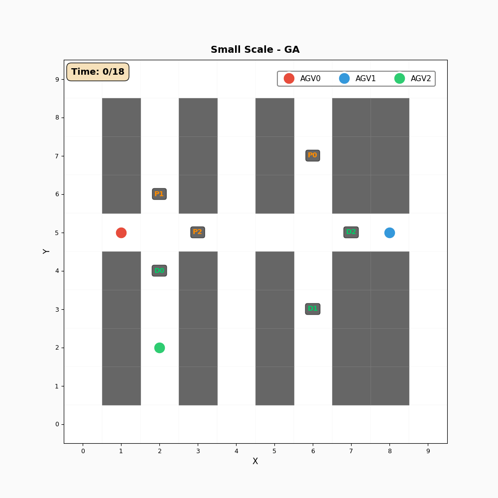
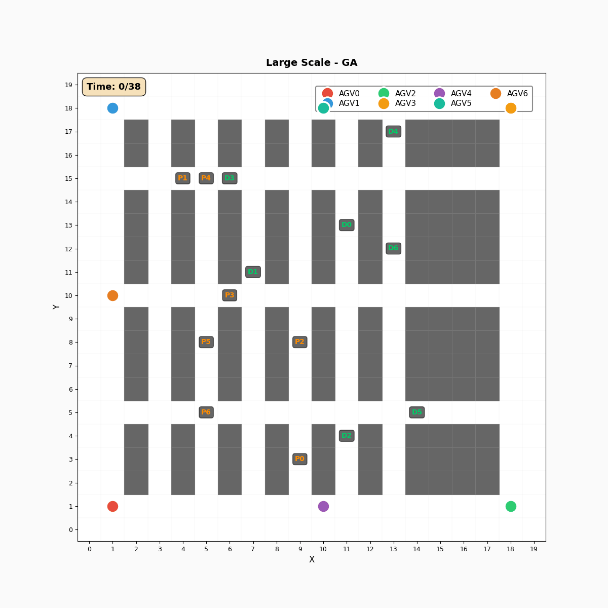
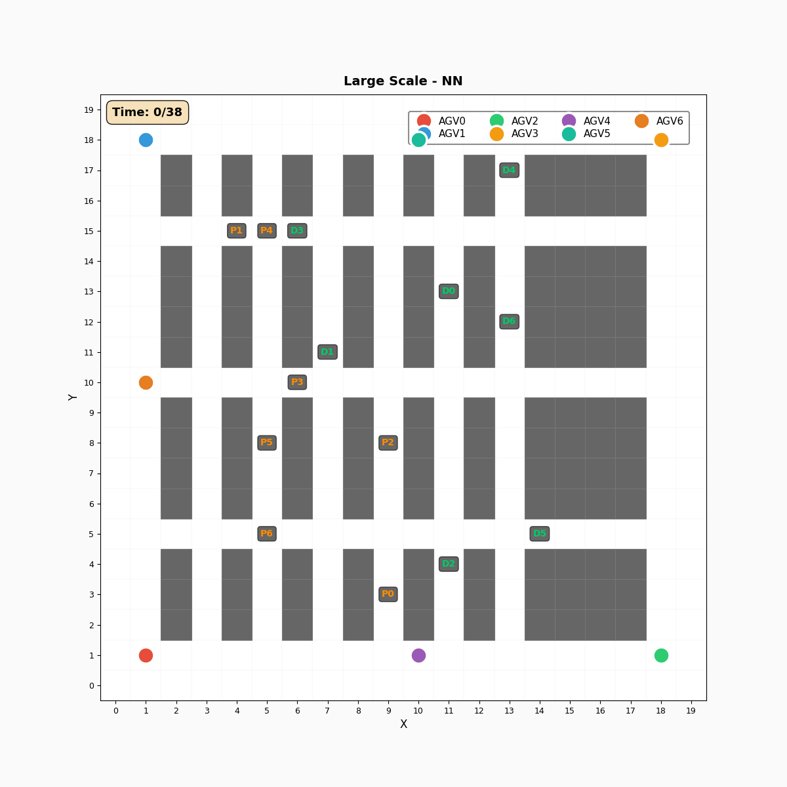
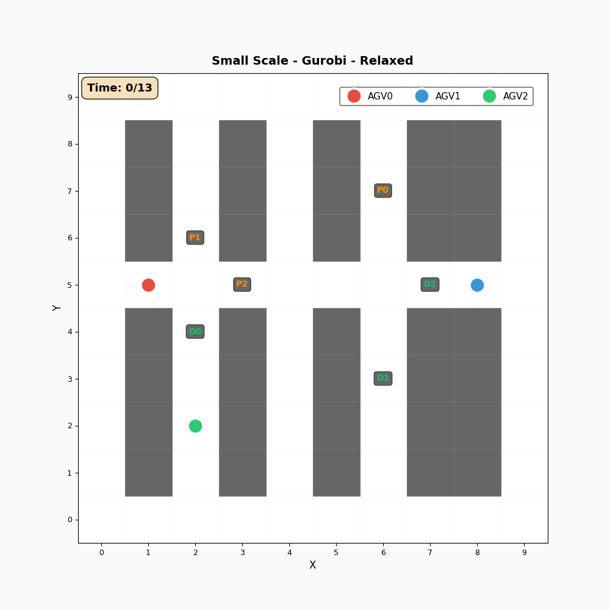
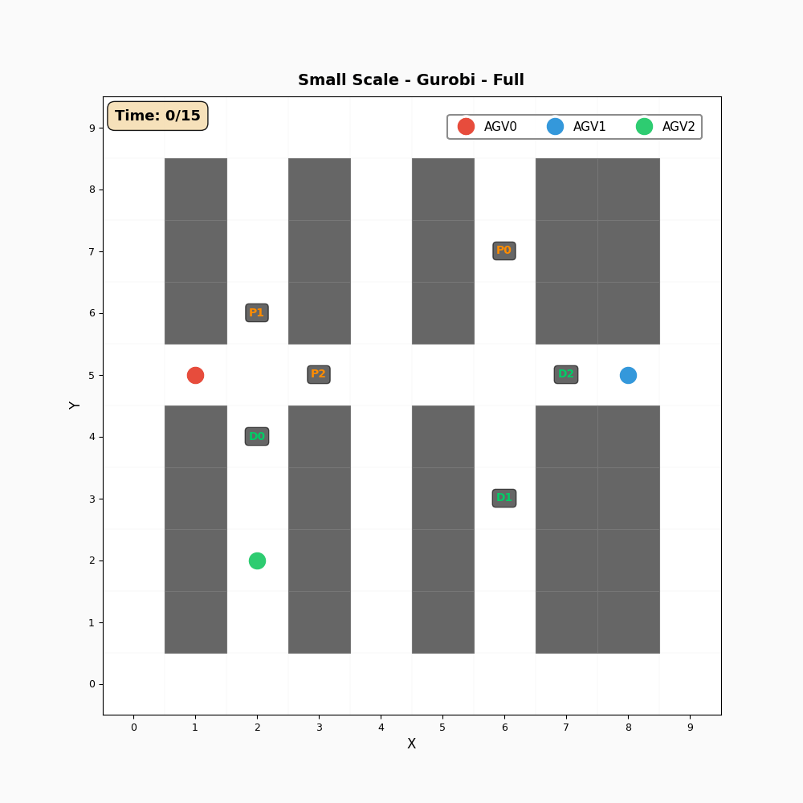
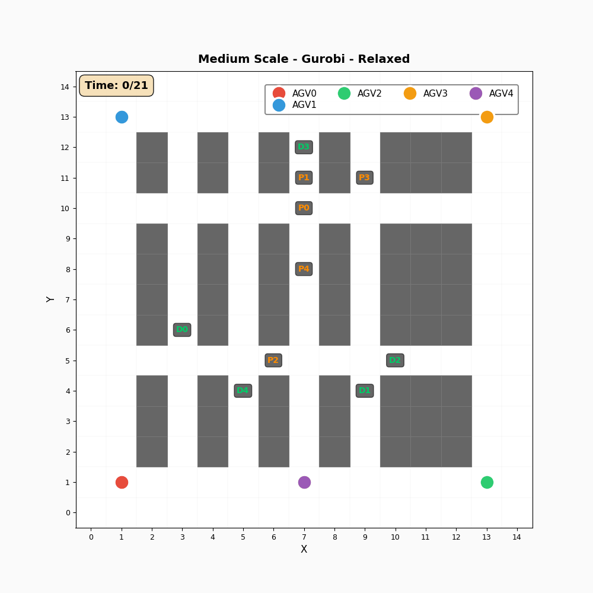

# 多智能体 AGV 任务分配与路径规划

> 面向仓库环境的多自动导引车（AGV）调度优化框架，采用分层架构：上层启发式任务分配 + 下层 A\* 路径规划与 Q-learning 避障，并与 Gurobi MIP 精确解进行对比验证。

## 项目概述

本项目实现了一个**两层优化框架**，用于传统通道式仓库布局下的多智能体 AGV 调度问题：

- **上层 — 任务分配**：枚举法（Enumeration）、遗传算法（GA）、最近邻法（NN）
- **下层 — 路径规划**：A\* 全局寻路 + 基于规则的 Q-learning 实时碰撞避让
- **基准 — MIP 求解**：Gurobi 求解 MIP 数学模型，提供理论最优对比

框架支持三种实验规模，并提供完整的可视化与解验证工具链。

## 系统架构

### 实验流水线

本项目实现了一套完整的多智能体路径规划实验流水线，涵盖从实例生成到启发式任务分配，再到混合整数规划（MIP）基准求解，最终进行验证与可视化展示。

### 流水线概览

| Step 1：实例生成 | Step 2：启发式任务分配 |   Step 3：MIP 基准求解    |
| :---: | :---: |:--------------------:|
| 地图生成 | 枚举法 / GA / NN |  Mode 1：松弛 MIP（下界）   |
| 任务生成 | A* + Q-learning 路径规划执行  | Mode 2：完整 MIP（含冲突约束） |

| 验证与可视化 |
| :---: |
| • 基于 MIP 约束的解验证（冲突、任务完成性、makespan） |
| • 动态 GIF / 静态布局可视化 |

## 实验规模

| 规模 | 网格尺寸 | AGV 数量 | 任务数量 | 用途 |
|------|----------|----------|----------|------|
| **Small** | 10×10 | 3 | 3 | 最优性验证（MIP 可完整求解） |
| **Medium** | 15×15 | 5 | 5 | 启发式方法对比 |
| **Large** | 20×20 | 7 | 7 | 可扩展性测试 |

所有规模均采用**传统通道式仓库布局**：平行货架行 + 垂直拣货通道 + 水平主通道。

## 环境依赖

- Python >= 3.8
- [Gurobi](https://www.gurobi.com/) >= 9.5（需要有效许可证，仅 Step 3 需要）

## 安装指南

```bash
# 克隆仓库
git clone https://github.com/chenhe04/agv-task-assignment-path-planning.git
cd agv-task-assignment-path-planning

# 安装依赖
pip install -r requirements.txt

# 生成 Q 表（路径规划必需，约 320MB，生成需要数分钟）
python make_qfunction.py
```

> **重要说明**：`yaml/qfunction.npy` 是预计算的规则 Q 表（约 320MB），用于 Q-learning 碰撞避让模块。由于文件过大，不包含在仓库中，必须在本地生成后方可运行路径规划。

## 使用方法

### Step 1：生成实验实例

```bash
python step1_create_instance.py
```

修改文件顶部的 `EXPERIMENT_SIZE` 变量选择规模（`'small'`、`'medium'` 或 `'large'`）。

**输出文件：**
- `instance.yaml` — AGV 起点、任务定义、网格数据
- `map_{规模}_traditional_aisle.yaml` — 仓库地图文件

### Step 2：运行启发式任务分配

三选一运行：
```bash
# 枚举法
python step2_run_paper_method_enum.py

# 遗传算法
python step2_run_paper_method_GA.py

# 最近邻法
python step2_run_paper_method_nearest.py
```

**可调参数**（在各文件顶部修改）：

| 参数 | 所在文件 | 默认值 | 说明 |
|------|----------|--------|------|
| `GA_GENERATIONS` | `step2_..._GA.py` | 1000 | GA 迭代代数 |
| `GA_POP_SIZE` | `step2_..._GA.py` | 100 | 种群大小 |
| `GA_MUTATION_RATE` | `step2_..._GA.py` | 0.7 | 变异率 |
| `GA_RANDOM_SEED` | `step2_..._GA.py` | 42 | 随机种子基准值，每次运行自动递增（`seed = GA_RANDOM_SEED + run`） |
| `NUM_RUNS` | 所有 step2 文件 | 10 | 独立运行次数 |

**输出文件：** `yaml/output_{方法}_{规模}.yaml` — 包含各 AGV 逐步位置的调度方案

> 说明：运行过程中会先生成中间文件（`yaml/output_ga.yaml`、`output_enum.yaml`、`output_nn.yaml`），最终复制为带规模后缀的目标文件。

### Step 3：运行 MIP 基准求解（Gurobi）

```bash
python step3_run_mip.py
```

修改文件顶部的 `MIP_MODE` 选择求解模式：
- `1` — 松弛 MIP（不含冲突约束，提供理论下界）
- `2` — 完整 MIP（含顶点冲突与边冲突约束）

### 可视化

```bash
# 生成 AGV 路径动态 GIF
python visualize_path_gif.py

# 生成仓库布局静态图片
python visualize_paths.py
```

修改 `visualize_path_gif.py` 顶部的全局配置：

| 变量 | 说明 | 默认值 |
|------|------|--------|
| `INPUT_PATH_FILE` | 输入路径 YAML 文件 | `yaml/output_ga_large.yaml` |
| `OUTPUT_GIF_FILE` | 输出 GIF 文件名 | `agv_paths_large_ga.gif` |
| `GIF_TITLE` | GIF 标题文字 | `"Large Scale - GA"` |
| `ANIMATION_FPS` | 动画帧率 | `1`（每步 1 秒） |

### 解验证

```bash
# 使用默认解文件（yaml/output_ga_large.yaml)
python verify_heuristic_solution.py

# 指定待验证的解文件
python verify_heuristic_solution.py --solution-file yaml/output_enum_small.yaml
```

对启发式解进行全面的 MIP 约束验证，包括：
- ✅ 初始位置正确性（t=0 时各 AGV 在指定起点）
- ✅ 移动连续性（每步仅允许相邻格移动或停留）
- ✅ 顶点冲突检测（同一时刻同一位置不能有多个 AGV）
- ✅ 边冲突检测（相邻时刻两个 AGV 不能交换位置）
- ✅ 任务完成性（pickup 和 dropoff 处需满足停留时间要求）
- ✅ Makespan 一致性

## 项目结构

```
agv-task-assignment-path-planning/
│
├── 核心算法模块
│   ├── astar_class.py                      # A* 寻路算法实现
│   ├── planning.py                         # 多智能体路径规划器（A* + Q-learning）
│   ├── taskassignment_GA.py                # 遗传算法任务分配
│   ├── decoder.py                          # 解码器适配层（GA 与 Planning 的接口）
│   └── make_qfunction.py                   # Q 表生成工具
│
├── 实验流水线
│   ├── step1_create_instance.py            # 实例生成器（地图 + 任务）
│   ├── step2_run_paper_method_enum.py      # 枚举法求解
│   ├── step2_run_paper_method_GA.py        # 遗传算法求解
│   ├── step2_run_paper_method_nearest.py   # 最近邻法求解
│   └── step3_run_mip.py                    # MIP 求解器（Gurobi）
│
├── 可视化与验证
│   ├── visualize_path_gif.py               # 动态路径可视化（GIF）
│   ├── visualize_paths.py                  # 静态布局可视化（PNG）
│   └── verify_heuristic_solution.py        # MIP 约束验证工具
│
├── 配置文件
│   ├── instance.yaml                       # 当前实验实例定义
│   ├── map_small_traditional_aisle.yaml    # 10×10 仓库地图
│   ├── map_medium_traditional_aisle.yaml   # 15×15 仓库地图
│   └── map_large_traditional_aisle.yaml    # 20×20 仓库地图
│
└── yaml/                                   # 输出结果目录
    ├── output_enum_{small,medium,large}.yaml   # 枚举法结果
    ├── output_ga_{small,medium,large}.yaml     # GA 结果
    ├── output_nn_{small,medium,large}.yaml     # NN 的结果
    ├── optimal_paths_*.yaml                    # MIP 最优路径
    └── qfunction.npy                           # Q 表（需本地生成）
```

## 关键参数配置

| 参数 | 默认值 | 说明 | 定义位置 |
|------|--------|------|----------|
| `LOAD_UNLOAD_TIME` | 1 | 装货/卸货时间（时间步） | `planning.py` / `step3_run_mip.py` |
| `BASE_STOP_TIME` | 1 | 普通航点停留时间（步） | `planning.py` |
| `MAX_PLANNING_STEPS` | 300 | 最大规划步数（防死循环） | `planning.py` |
| `TIME_LIMIT` | 6000 | Gurobi 求解时限（秒） | `step3_run_mip.py` |

## 算法说明

### A\* 寻路（`astar_class.py`）
采用曼哈顿距离作为启发函数，在网格地图上搜索从起点到终点的最短路径。支持自定义障碍物列表。

### Q-learning 碰撞避让（`planning.py`）
采用**预计算的规则 Q 表**（非在线学习），基于 5×5 局部观测窗口，观测周围 AGV 和障碍物的分布，结合目标方向和会车冲突信息，选择最优动作（上/下/左/右/停留）。

### 遗传算法（`taskassignment_GA.py`）
- **编码**：排列编码，每个个体表示一种任务分配方案
- **选择**：精英保留策略（保留前 50%）
- **交叉**：交换交叉算子
- **变异**：交换变异算子（概率由 `GA_MUTATION_RATE` 控制，默认 0.7）
- **适应度**：最大完工时间 + 总完工时间 / 1000（越小越好）

### MIP 模型（`step3_run_mip.py`）
基于  MIP 建模，使用 Gurobi 求解。
- **Mode 1（松弛版）**：不含冲突约束，提供理论下界，可快速求解
- **Mode 2（完整版）**：含顶点冲突与边冲突约束，保证无碰撞路径

## 示例结果

### 路径动画

| 规模 | 枚举法 | 遗传算法 | 最近邻法 |
|------|--------|----------|----------|
| Small |  |  |  |
| Medium |  |  |  |
| Large |  |  |  |

### MIP 求解结果

| 规模 | 松弛 MIP（Mode 1） | 完整 MIP（Mode 2） |
|------|-------------------|-------------------|
| Small |  |  |
| Medium |  | — |
